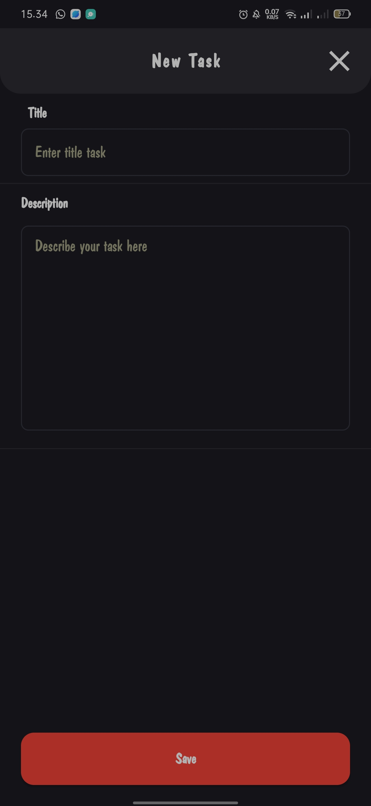

# Mobile App: Habiter

## Description

Habiter is a mobile app designed for seamless task management and organization. It simplifies adding tasks with details like titles, due dates, and categories. The app features a calendar view to track upcoming, ongoing, and completed tasks. With a user-friendly interface and a login/logout option for personalized use, Habiter aims to streamline and enhance daily task management.
The Habiter application is very useful for you in managing your daily habits so that they are well organized.

If you are interested in using the Habiter application, you can download it on [Google PlayStore](https://play.google.com/store/apps/details?id=uas.pam.habiter)

**Habiter! Stay organized and get things done!**

## Meet Us!
| Name                   | NIM             |
|------------------------|-----------------|
| Muhammad Rihap Firdaus | 1217050102      |
| Ridwan Ahmad Fauzan    | 1217050121      |
| Sumitra Adriansyah     | 1217050137      |
| Wildan Sophal Jamil    | 1217050142      |

## Screenshots

  
<b>Click to expand</b>

### Sign Up Page
  

    
  

### Sign In Page
  

    
  

### Dashboard Page
  

    
  

### Add Task Page
  

    
  

### Setting Page
  

    
  

### Edit Profile Page
  

    
  

### Delete Account Page
  

    
  

## Habiter Promotion
"Don't miss out on this special opportunity! Tune in to our mobile app advertisement now to experience an extraordinary journey that will revolutionize your interaction with technology!"
[Watch Now](https://youtu.be/mCjvuOkcN1k)

## Pitch Deck
[PPT](https://www.canva.com/design/DAF4hnRUuMw/bYrc_ZSmPSgy43ilkcESGw/edit?utm_content=DAF4hnRUuMw&utm_campaign=designshare&utm_medium=link2&utm_source=sharebutton)

## Features
Habiter has basic features to manage tasks more effectively. The basic features available on Habiter include:

- **Add tasks**: This feature allows users to add new tasks to their to-do list. Users can add task titles, task descriptions, due dates, and task categories.
- **View the calendar**: This feature allows users to view a calendar that displays all the tasks they have. Users can view upcoming tasks, tasks in progress, and completed tasks.
- **Login/logout**: This feature allows users to log in to their accounts and log out of their accounts. Users need to create an account to use Habiter.
With these basic features, Habiter can fulfill the basic needs of users to manage their tasks.

## Requirements

## Installation
